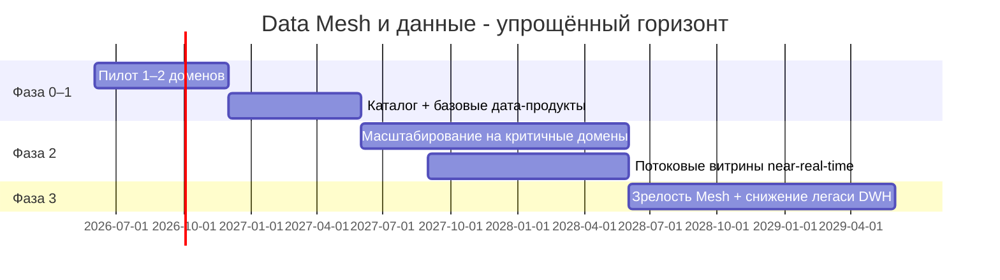

# Стратегический роадмап внедрения Data Mesh («Будущее 2.0»)

## Роли (ключевые)

| Роль                             | Назначение в Data Mesh                                                                                                                |
|----------------------------------|---------------------------------------------------------------------------------------------------------------------------------------|
| **Data Product Owner**           | Владелец конкретного дата-продукта в домене: метрики качества, SLA, доступы, роадмап потребителей (BI, партнёры, внутренние сервисы). |
| **Data Engineer**                | Реализация пайплайнов, контрактов событий/таблиц, интеграция с lakehouse, тесты качества данных, CI/CD для данных.                    |
| **BI-аналитик**                  | Семантический слой, отчёты и self-service в портале; связь с бизнес-владельцами; без обхода границ PHI.                               |
| **Платформенная команда данных** | Общий каталог, политики безопасности, шаблоны пайплайнов, поддержка брокера событий и хранилищ (федеративная платформа).              |
| **Архитектор / Domain lead**     | Границы контекстов, совместимость событий с целевой событийной архитектурой (см. Task4).                                              |

---

## Фазы и этапы

### Этап 1. Пилот (≈ 6–9 месяцев)

**Цель бизнеса:** доказать ценность self-service и доменных витрин без расширения PHI в аналитику.

| Действие                                                                      | Роли                           | Результат                            |
|-------------------------------------------------------------------------------|--------------------------------|--------------------------------------|
| Выбор 1–2 доменов (напр. финансовые метрики + пациентский поток на агрегатах) | Data Product Owner, архитектор | Ограниченный контур пилота           |
| Первые **дата-продукты** (dataset/API) с SLA и описанием в каталоге           | Data Engineer, DPO             | Каталог не пустой, есть потребители  |
| Портал / BI на витрине пилота                                                 | BI-аналитик                    | Сокращение времени на типовые отчёты |
| Обучение ролей и регламент доступа                                            | Платформа, ИБ                  | Снижение риска утечек                |

**Бизнес-KPI:** сокращение времени на типовой отчёт; удовлетворённость владельцев домена.

### Этап 2. Масштабирование (≈ 12–18 месяцев)

**Цель бизнеса:** подключить критичные домены (клиника, финтех, ИИ - в части **разрешённых** данных).

| Действие                                            | Роли                     | Результат                                          |
|-----------------------------------------------------|--------------------------|----------------------------------------------------|
| Несколько доменов как **продюсеров** дата-продуктов | DPO, Data Engineer       | Федеративная модель начинает работать              |
| Потоковые витрины для операционных дашбордов        | Data Engineer, платформа | Near-real-time вместо только batch                 |
| Укрепление **качества данных** (DQ как код)         | Data Engineer            | Меньше инцидентов в отчётности                     |
| Связка с **событийной** архитектурой (Kafka)        | Архитектор, платформа    | Меньше дублирования между operational и analytical |

**Бизнес-KPI:** время принятия решений в операциях; доля отчётов из self-service vs ad-hoc к DWH.

### Этап 3. Поддержка и зрелость (ongoing, акцент на год 3+)

**Цель бизнеса:** устойчивая модель «данные как продукт», легаси-DWH не на критическом пути.

| Действие                                  | Роли                  | Результат                                            |
|-------------------------------------------|-----------------------|------------------------------------------------------|
| Передача владения дата-продуктами доменам | DPO                   | Меньше зависимости от центральной «аналитической IT» |
| FinOps по доменам                         | DPO + финансы         | Прозрачная себестоимость данных                      |
| Ревизия легаси-потоков из DWH             | Платформа, архитектор | Сокращение TCO легаси (см. `tco-analysis.md`)        |

**Бизнес-KPI:** стоимость владения данными на домен; скорость подключения нового источника (фарма, OEM).

## Привязка к бизнес-целям (матрица)

| Бизнес-цель                        | Как помогает Data Mesh на этом роадмапе                                                       |
|------------------------------------|-----------------------------------------------------------------------------------------------|
| Новые продукты и монетизация ИИ    | Доменные дата-продукты быстрее подключают аналитику и партнёров без центрального узкого места |
| География                          | Повторяемые шаблоны каталога и витрин для новых регионов                                      |
| Больше источников и near-real-time | Потоковые витрины + события как источник истины для агрегатов                                 |
| Событийная платформа               | Дата-продукты строятся поверх контрактов событий и lakehouse, а не только на ночных выгрузках |

## Риски

- **ИБ и комплаенс:** на каждом этапе - согласование классов данных и портала self-service.
- **Платформа данных:** без стабильного каталога и оркестрации Mesh превращается в «ещё одно озеро файлов».
